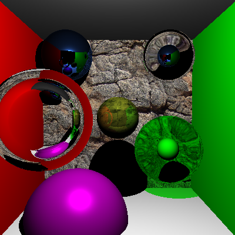
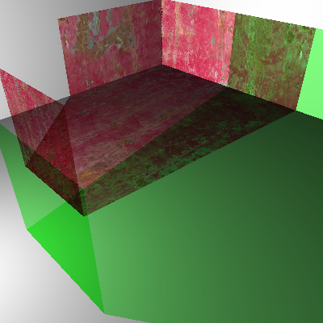
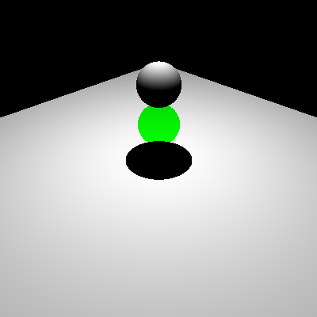
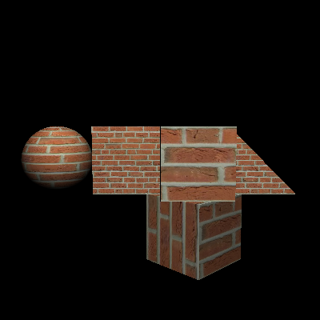
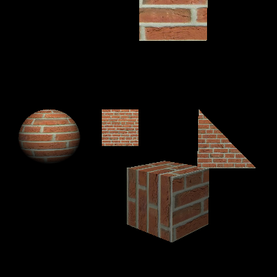

Ray Tracer Part II
======================

Implement
---------------------
1.Multithreading 

2.Phong Material 

3.Specular Reflection 

4.pecular Transmission 

5.Shadows Cast by Transmissive Objects 

6.Texture Mapping

Rendering Results
-------------------

(test scene for texture mapping)

